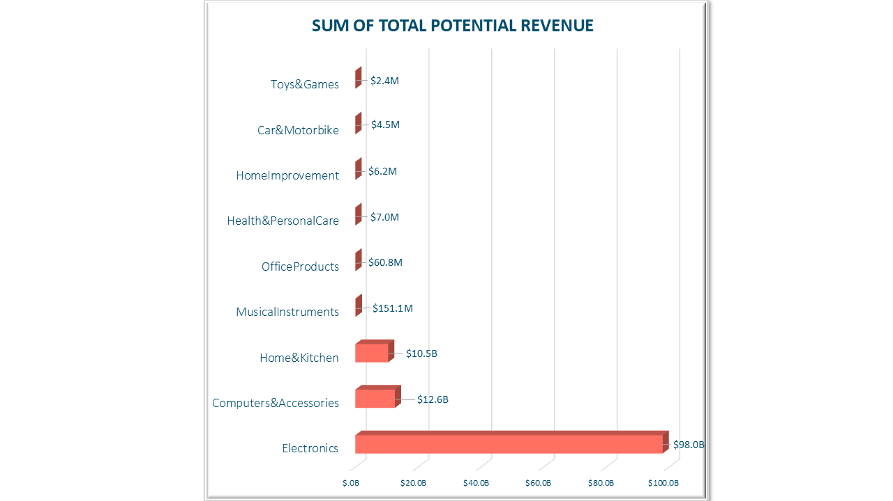
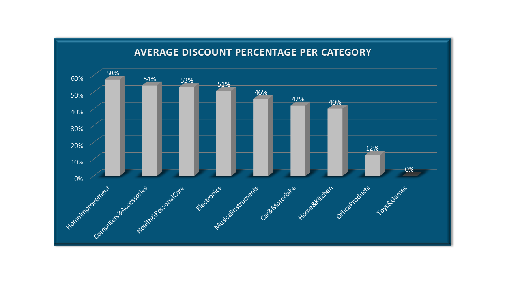
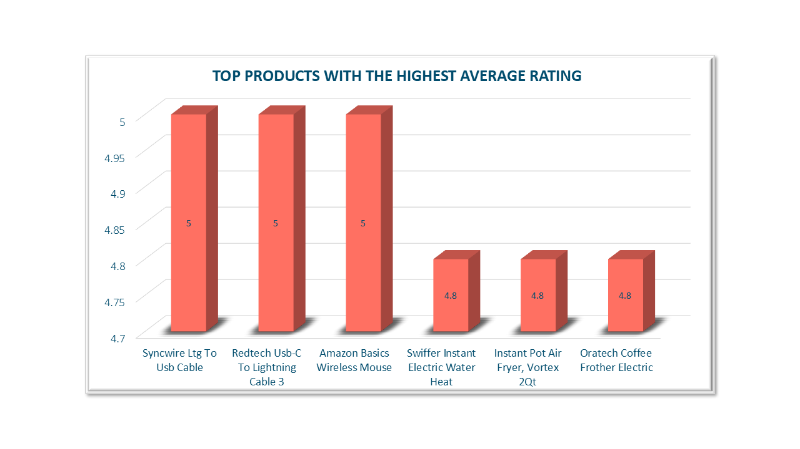
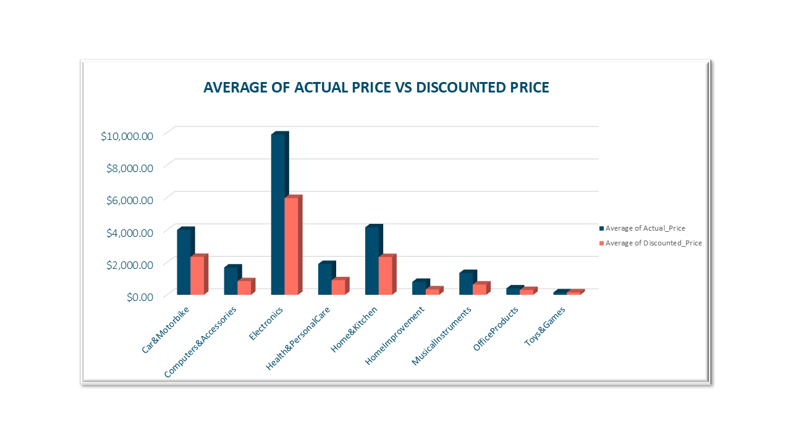
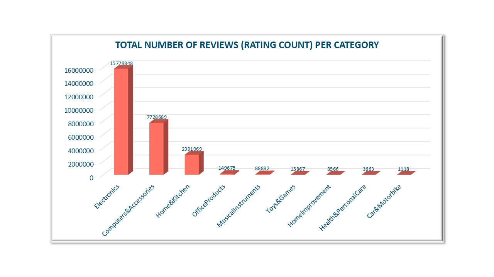
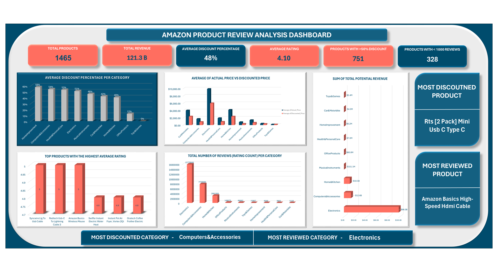

# 📦 DSA-Amazon-Case-Study-Project
## Project Overview
This case study analyzes Amazon product and customer review data for **RetailTech Insights**, a company providing e-commerce analytics solutions for sellers on platforms like Amazon. The aim of the analysis is to uncover key insights about product performance, customer sentiment, and review trends that can inform product improvements, marketing strategies, and customer engagement initiatives. The entire analysis was conducted using **Microsoft Excel**, leveraging pivot tables, calculated fields, and charts to generate meaningful insights.
## 📝 Company Overview
**RetailTech Insights** is an e-commerce analytics company that supports Amazon sellers by providing actionable data insights. The team’s goal is to help clients optimize product performance, pricing strategies, and customer engagement through data analysis.
## 📂 Dataset Used
The dataset was scrapped from Amazon project pages and it contains:
- **Product Details**: Name, Category, Price, Discount and ratings
- **Customer Engagement**: Rating Count, Review Title and Review content

Each row represents a unique product with aggregated reviewer data.
## 🛠 Tools & Technologies
 **Microsoft Excel**
  - Data cleaning (handling missing values, correcting formats)
  - Use of pivot tables for aggregation
  - Calculated columns (e.g., discounted price, total potential revenue, combined score(ratings and ratings count combined))
  - Charts and graphs for visual analysis (bar charts, column charts)
## 📌 Key Features
- Cleaned and prepared raw Amazon product data for analysis
- Created pivot tables to summarize:
  - Average discount per category
  - Total number of products per category
  - Total number of reviews per category
  - Top 5 products with the highest average ratings
  - Average actual price vs average discounted price per category
  - Top 10 products with the highest number of reviews
  - Total number of products with more than 50% discount
  - Product rating distribution
  - Total potential revenue
  - Total number of unique products per price range bucket
  - Relationship between discount level and ratings
  - Total number of products with less than 1000 reviews
  - Product category with the highest discount
  - Top 5 products in terms of ratings and number of reviews combined
- Designed clear, easy-to-read charts to display insights
- Used calculated columns to derive additional metrics (e.g., discounted price)
## 🎯 Key Insights
- Electronics leads the total potential revenue massively with aproximately $98 billion potential revenue.
  - Electronics is the most profitable focus area. Marketers and product teams should prioritize this category for campaigns and stock optimization.
- Electronics is not only the top revenue category but also attracts the most customer engagement of approximately 15.78 million reviews.
- Tech accessories drive consistent high volume engagement as the most reviewed product is in the Electronics Category.
- Accessories and small electronics dominate top-rated product lists, showing where customer satisfaction is highest.
- 751 products (over 50% of the data set) had discounts of 50% or more. This indicates aggressive discounting. Sellers should implement a balance so as to maintain product value perception.
 - Products with higher discounts (>50%) tend to have slightly lower average ratings (4.06) compared to products with <20% discount (4.17), suggesting a potential negative relationship between heavy discounting and perceived product quality.
- 328 products have lower than 1000 reviews. This indicates that many products have low visibility which in turn presents opportunities for marketing and review generation

## 📈 How This Analysis Supports Decision Making
- **Total Potential Revenue**: This highlights where sellers should focus inventory, product development, and sales efforts.

- **Average Discounts Per Category**: This provides guidance on pricing strategies to stay competitive without compromising profitability.

- **Top Average Ratings**: This identifies items that exceed customer expectations, offering a model for future product design and quality standards.

- **Average Actual Price vs Discounted Price**: This guides more targeted discounting and help balance competitiveness with profitability.
  
- **Products With Less Than 1000 Reviews**: This highlights items that may need greater promotional support or visibility to build trust and reputation.

   
- **Total Reviews Per Category**: This shows where customer engagement is strongest, helping teams prioritize marketing and customer service efforts.

**Together, these insights provide Amazon sellers and marketing teams with data-driven guidance to enhance product performance, optimize pricing, improve customer satisfaction, and drive engagement.**
## Analytics Dashboard Overview

## ✅ Conclusion
This analysis provided valuable insights into Amazon product performance, customer sentiment, and review trends. By leveraging Excel to explore patterns in pricing, discounts, ratings, and customer engagement, the findings can guide data-driven decisions for product improvement, smarter marketing strategies, and stronger customer relationships. The results highlight the importance of balancing price, quality, and visibility to succeed in a competitive e-commerce environment.

*Authored By*: **Canaan Olanipekun**

*Date*: **June 2025**
